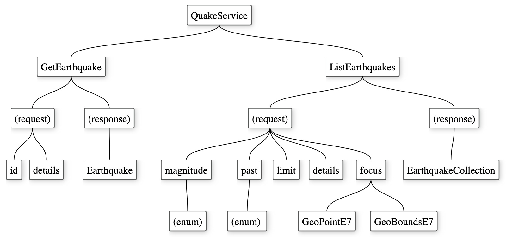
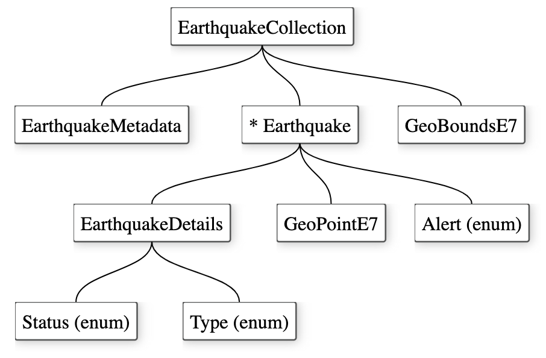

# Earthquakes - the gRPC service

A gRPC service for monitoring earthquakes based on data provided by the USGS.

## Introduction

This repository contains [gRPC](https://grpc.io/) message and service 
definitions for integrating a backend server (providing earthquake data) and 
frontend user interfaces (any client supporting gRPC).

It contains also a backend server implementation based on 
[Go](https://golang.org/) that fetches and caches data from the 
[GeoJSON feed](https://earthquake.usgs.gov/earthquakes/feed/v1.0/geojson.php) 
of the USGS Earthquake Hazards program.

USGS already provides RESTful or JSON services for earthquakes, so why bother to build
a gRPC service for exactly same data? Well the main reasons for this repository
are:
* Learning and evaluating possibilities of gRPC and Protocol Buffers.
* Developing an optimized backend for mobile clients.

Also some additional benefits for using gRPC:
* The API - both data model and service calls - is well defined using the service definition language that's easy to understand.
* With API definitions it's easy to generate compatible client and server stubs for different languages.
* Tools for gRPC are battle-tested and integrations for all relevant platforms exists.
* A service can be optimized as a mobile backend that sends only queried and filtered data to mobile clients.
* Efficient binary encoding for wire transfer as a bonus.

## Running the quake-server

To run you need to have Go (at least version 1.13) installed on your system.

The quake-server has 
a main() function in the *cmd/quake-server/main.go* source file.

Under a local repository clone please compile and run:
```
$ cd cmd/quake-server
$ go build
$ ./quake-server
```

This runs a gRPC server instance listening on a local port 50051. By setting 
enviroment variable PORT you can modify a port to be listened.

Commands above create an executable file under a source folder. To clean up:
```
$ cd cmd/quake-server
$ go clean
```

## Testing using the quake-client

The quake-client is a simple CLI command to test a gRPC service and it has 
a main() function in the *cmd/quake-client/client.go* source file.

Under a local repository clone please compile and run:
```
$ cd cmd/quake-client
$ go build
$ ./quake-client help
```

By default the client accesses `localhost:50051` server address. This can be 
modified by setting a QUAKE_SERVICE environment variable.

Some examples for requesting earthquakes using command line:
```
$ ./quake-client ListEarthquakes significant 7days
$ ./quake-client ListEarthquakes 2.5 day 5 
```

Commands above create an executable file under a source folder. To clean up:
```
$ cd cmd/quake-client
$ go clean
```

## gRPC definitions

The service - or the integration layer between a server and a client - is defined 
using [Protocol Buffers](https://developers.google.com/protocol-buffers) with 
.proto files under the `api/v1` folder. 

Package names:

Platform         | Package
---------------- | ----------- 
Protocol buffers | quake.api.v1
Go               | github.com/navibyte/quake/api/v1

The *QuakeService* provides following RPC methods:

Method          | Description
--------------- | ----------- 
ListEarthquakes | Get list of earthquakes for given period and magnitude.
GetEarthquake   | Get an earthquake by id.

Service definition as a diagram:


Data structures used by the methods represent data based on the
[GeoJSON Summary Format](https://earthquake.usgs.gov/earthquakes/feed/v1.0/geojson.php) of the USGS Earthquake Hazards program. Data structures are 
optimized for the wire usage.

The domain model defined as Protocol Buffer messages:

Message              | Description
-------------------- | ----------- 
EarthquakeCollection | Contains a list of earthquakes, metadata and geographic bounds.
Earthquake           | An earthquake with id, properties and geographic position with optional reference to detailed information (on EarthquakeDetails).
EarthquakeDetails    | Detailed properties for an earthquake.
EarthquakeMetadata   | Meta data for a set of earthquakes.

Location data is modeled as messages:

Message     | Description
----------- | ----------- 
GeoBoundsE7 | Geographical bounding box (min and max points) in E7 format.
GeoPointE7  | Geographical point (latitude, longitude, height) in E7 format.

There are also some enums used by the domain model:

Enum   | Description
------ | ----------- 
Alert  | An alert as suggested level of response for an earthquake occurred.
Status | Whether earthquake data is reviewed by a human or not.
Type   | A type of a seismic event, like 'earthquake' or 'quarry'.

Message definitions as a diagram:


## Go module

There is a standard Go module configuration with go.mod file on the repository root:
* Go version (minimum): 1.13
* Module name: **github.com/navibyte/quake**

Dependencies (see go.mod for version information):
* github.com/golang/protobuf
* github.com/stretchr/testify (indirect)
* google.golang.org/grpc 
* github.com/tidwall/gjson 

On this repository:
* generated Go code under `api` folder, please do not edit generated files by hand
* Go source code under `cmd`, `internal` and `pkg` folders structured by following guidelines from [Standard Go Project Layout](https://github.com/golang-standards/project-layout)

## Code generation

The repository contains .proto files for API definitions and also generated .go 
files for server interface code and client side stubs.

If you like or need to regenerate server interfaces and client stubs for Go then 
you need a development environment with following command line tools:
* protoc (Protocol Buffer v3)
* protoc-gen-go (protoc compiler extension for Go)

Please consult following quick start quide to setup your environment first:
* [Go Quick Start for gRPC](https://grpc.io/docs/quickstart/go/)

When needing regeneration then on your development enviroment cd to the *api/v1* 
folder and run *make* command to generate Go code. Generated code is stored on 
the same folder with .proto-files.

This process is defined on the Makefile. Please note that it assumes that the
repository folder name on a local environment is `quake` - nothing else.

## Go source and generated code

Package `github.com/navibyte/quake/api/v1`:

Source         | Description
-------------- | ----------- 
quake.go       | Generated Go code for the domain model.
quake_api.go   | Generated Go code for client stubs and abstract service classes of the QuakeService.

Package `github.com/navibyte/quake/cmd/quake-client`:

Source         | Description
-------------- | ----------- 
client.go      | A test client for accessing a QuakeService based on gRPC.

Package `github.com/navibyte/quake/cmd/quake-server`:

Source         | Description
-------------- | ----------- 
main.go        | main() for opening a TCP-listener and starting a gRPC-server.
mock.go        | Mocks for creating mock earthquake objects for dev test purposes only.
server.go      | The implementation for QuakeService delegating actual request processing for code available on the package `github.com/navibyte/quake/pkg/earthquakes/usgs`.

Package `github.com/navibyte/quake/internal/geolib`:

Source         | Description
-------------- | ----------- 
geo_e7.go      | Helper functions to convert latitude and longitude between double and E7 integer representations. Also a method to calculate distances using the [haversine formula](http://mathforum.org/library/drmath/view/51879.html).

Package `github.com/navibyte/quake/internal/jsonlib`:

Source         | Description
-------------- | ----------- 
cursor.go      | A helper wrapper to [gjson](https://github.com/tidwall/gjson) library that is a fast JSON parser for Go.

Package `github.com/navibyte/quake/internal/mathlib`:

Source         | Description
-------------- | ----------- 
math.go        | Few simple math related helper functions.

Package `github.com/navibyte/quake/pkg/earthquakes/usgs`:

Source         | Description
-------------- | ----------- 
cache.go       | A local in-memory-object cache for earthquake data fetched. Also synchronizes calls to remote service (see fetch.go) to ensure that only one fetch operation is active for each remote resource.
fetch.go       | Calls the REST/JSON remote service (USGS) to fetch earthquake data.
parse.go       | Parses GeoJSON data structures to domain model structures generated by a gRPC tool.
repository.go  | Implements GetEarthquake and ListEarthquakes functions using caching, fetching and parsing functionality.

There are also unit tests (*_test.go) available for source code files on 
this `usgs` package testing caching, parsing and the whole repository.

## Authors

This project is authored by **[Navibyte](https://navibyte.com)**.

## License

This project is licensed under the MIT License - see the [LICENSE](LICENSE).

## Links

### Domain model

More information about domain model of USGS earthquake data:
* [About USGS Earthquake Hazards program](https://www.usgs.gov/natural-hazards/earthquake-hazards/about)
* [GeoJSON Summary Format](https://earthquake.usgs.gov/earthquakes/feed/v1.0/geojson.php)
* [ComCat Documentation - Event Terms](https://earthquake.usgs.gov/data/comcat/data-eventterms.php)
* [ComCat Documentation - Metadata Terms](https://earthquake.usgs.gov/data/comcat/data-metadata.php)
* [PAGER Scientific Background](https://earthquake.usgs.gov/data/pager/background.php)

### Schema language

External references consulted when designing protocol buffer schemas on this 
repository:
* [gRPC - A high performance, open-source universal RPC framework](https://grpc.io)
* [Language Guide (proto3)](https://developers.google.com/protocol-buffers/docs/proto3)
* [Uber Protobuf Style Guide V2](https://github.com/uber/prototool/blob/dev/style/README.md)
* [Buf - Style Guide](https://buf.build/docs/style-guide)
* [Protocol Buffers - Style Guide](https://developers.google.com/protocol-buffers/docs/style)

### gRPC

Tutorials consulted when building the demo app:
* [Go Quick Start](https://grpc.io/docs/quickstart/go/)
